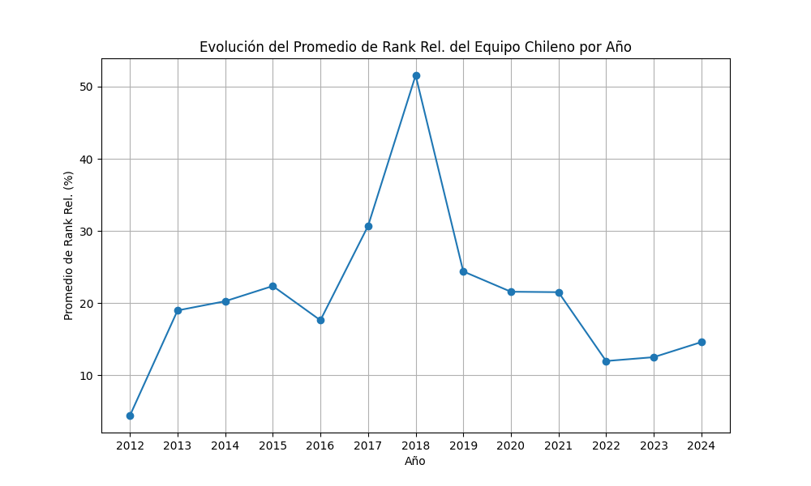
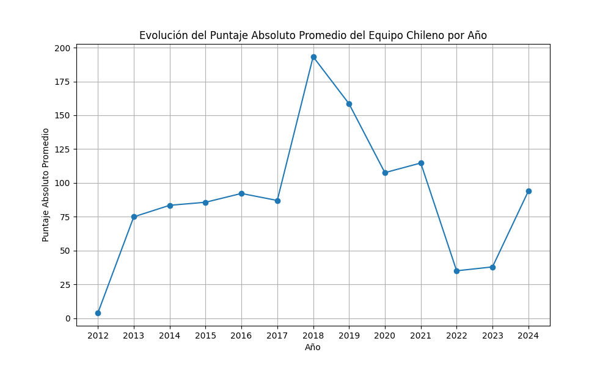
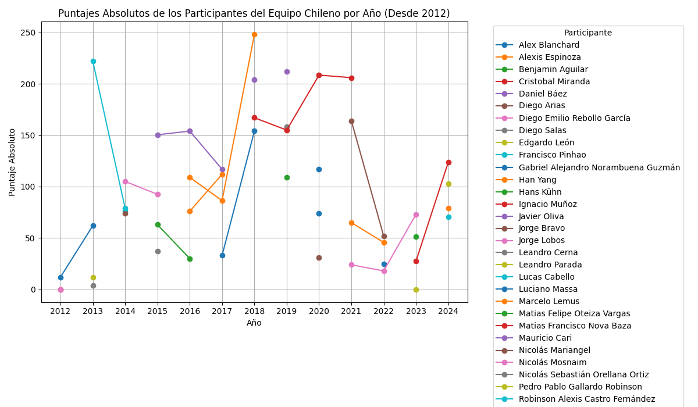
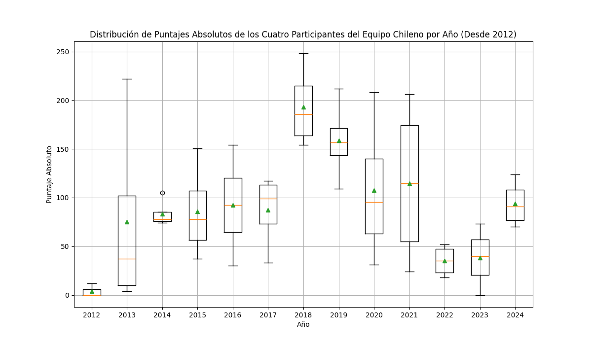
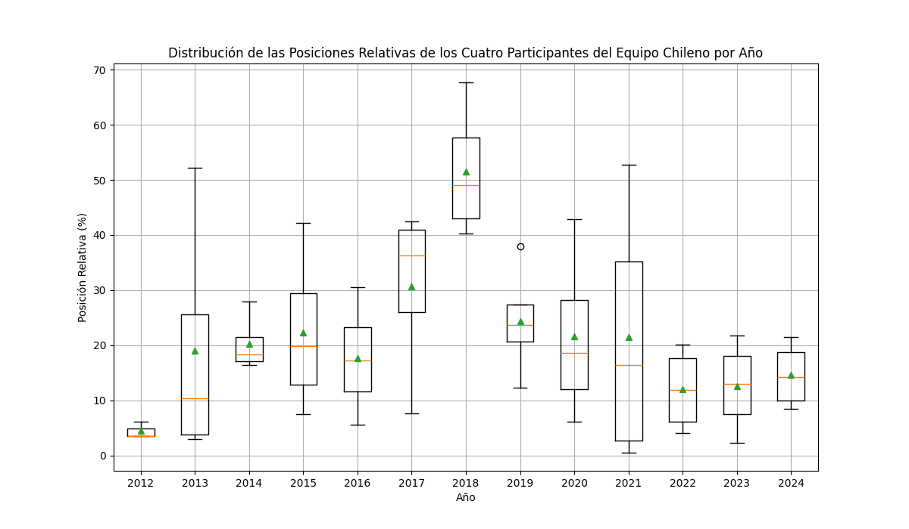

# Análisis de Chile en la IOI

Esto es un breve análsis de cómo le ha ido a Chile en la Olimpiada Internacional de Informática (IOI). Se va a considerar sólo las estadísticas desde el 2012 ya que es desde el año en que hay datos. Se ocupó la estadística oficial de la IOI https://stats.ioinformatics.org/results/CHL.

## Scripts

- `request_stats.py` descarga los resultados de Chile en `resultados_chile.csv`.

- `main.py` crea los gráficos.

## Gráficos

## Conclusiones

Se observa una mejora notable en el desempeño del equipo chileno entre los años 2017 y 2021, con un destaque especial en 2018 y 2019. Sin embargo, en los últimos tres años, el desempeño ha mostrado una tendencia a la disminución y al estancamiento.

Para este análisis, la posición relativa ha sido considerada como una métrica más significativa que el puntaje absoluto. Esto se debe a que la posición relativa no está tan influenciada por la variabilidad en la dificultad de los problemas, lo que proporciona una evaluación más consistente del rendimiento.